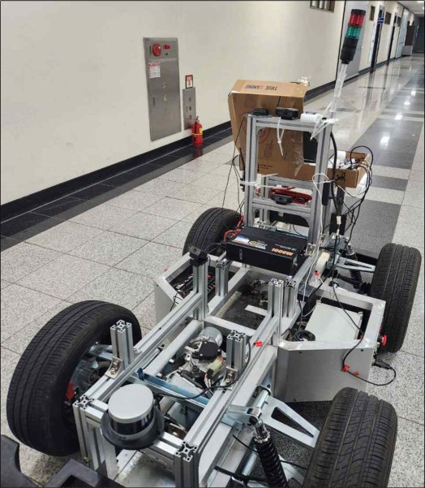
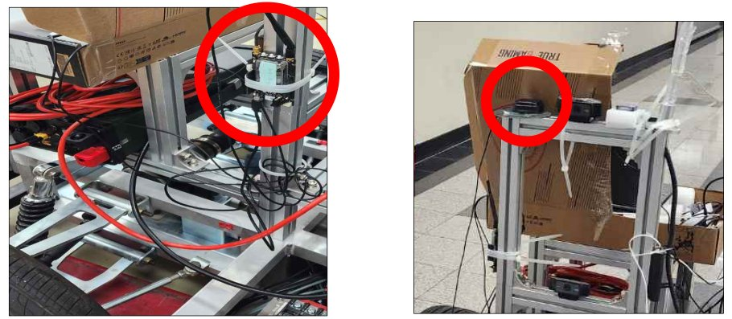
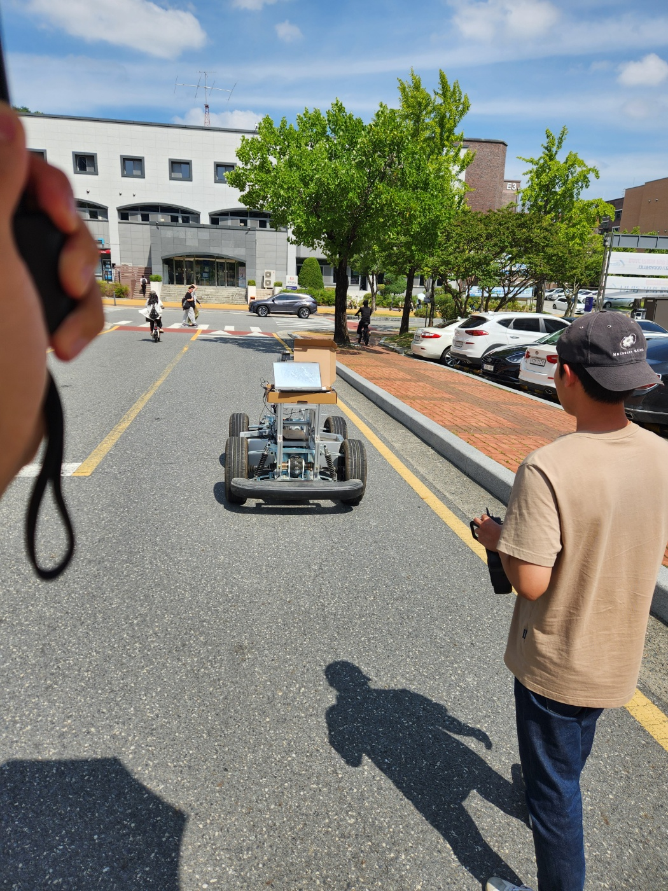
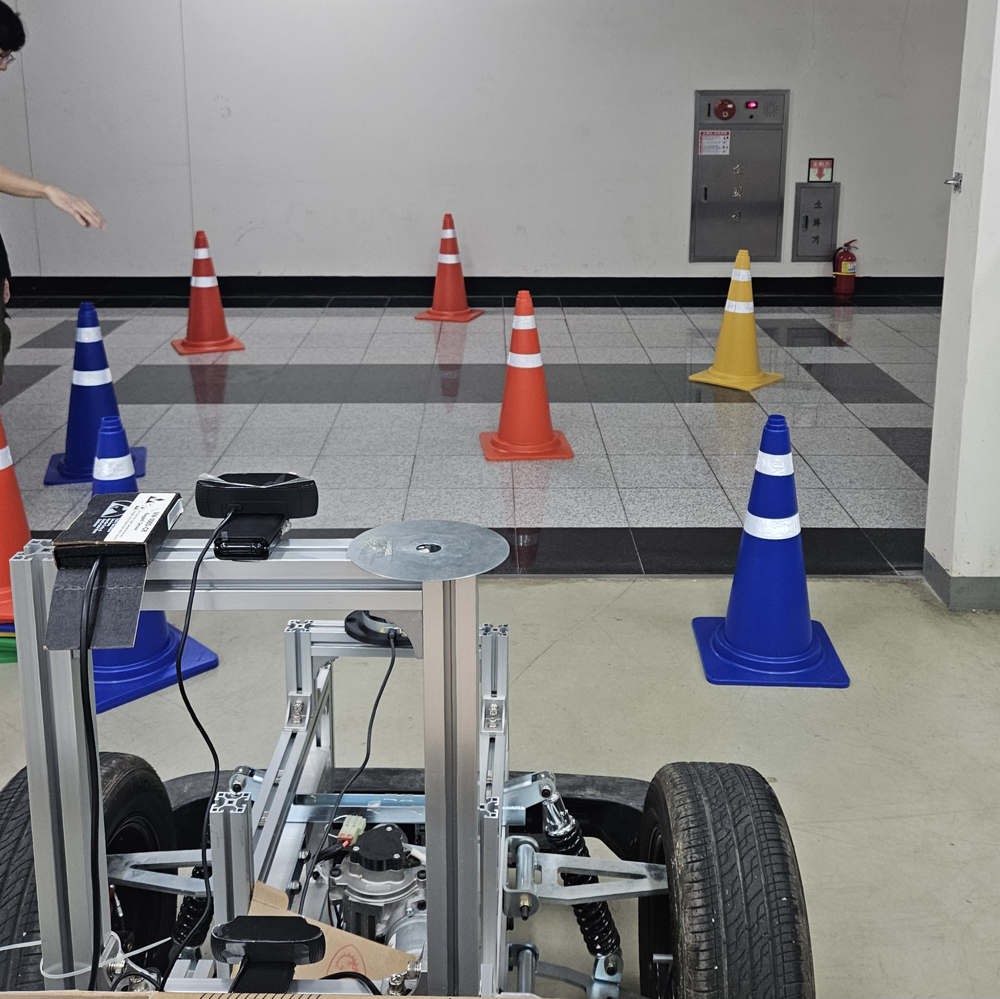

# ERP42 자율주행 워크스페이스

2025 대학생 창작모빌리티 경진대회 출품용 ERP42(Wego Robotics 4륜 전기차) 자율주행 스택이다. GPS·IMU·엔코더로 위치를 추정하고, 미리 기록한 GPS waypoint 경로를 추종하도록 ERP42에 조향·속도 명령을 보낸다. ROS 2 Humble 기반이며, 노드 대부분은 Python(rclpy)으로 작성했다.

> 출처: 팀 MTP(충남대) 팀 프로젝트(실개발 2~3인)의 대회 코드. 대회 뒤 이 저장소에서 바뀐 것은 README 정리와 `src/` 배선 버그 일부 수정이다(내용은 [`src/README.md`](src/README.md)).

> 🎬 **대표 영상·자료** — 우리 팀 대회 주행 영상은 없어 다음 자료로 대신한다: [대회 진행 방식 참고 영상](https://www.youtube.com/watch?v=YCeGdbSMRuc)(본선 출전 팀 주행, 우리 팀 아님) · [waypoint 추종·LiDAR 회피 테스트 영상](assets/erp42_test_waypoint_lidar_avoid.mp4)(팀 내부, 71초)
>
> 📄 [연구계획서(PDF, 10쪽)](assets/erp42_research_plan.pdf) · [기술보고서(PDF, 22쪽)](assets/erp42_tech_report.pdf) — 세부 기술 문서

> **핵심 설계**: 주행 명령을 내는 노드(경로추종·차선)는 시리얼에 직접 쓰지 않는다. 각자 `/erp42_ctrl_cmd/<출처>`로 발행하고, `erp42_controller.py` 한 곳이 최근 0.2초 안에 들어온 유효 명령 하나를 골라 `/erp42_ctrl_cmd`로 넘긴다. 유효 명령이 없으면 Controller가 brake=155 정지 명령을 낸다. 명령 출처가 바뀌어도 시리얼 노드는 수정 없이 그대로 쓸 수 있게 나뉘어 있다.

<a id="contribution"></a>
## 프로젝트 요약 · 본인 담당 (김관희)

> 포트폴리오용 프로젝트 요약입니다. 이 저장소의 코드는 팀 MTP의 대회 코드이고, 제 역할 범위는 **본인 담당** 행에 적었습니다. 접힌 '프로젝트 기술 전체'는 팀 전체 시스템 설명입니다. 다른 프로젝트: [github.com/gwanhuiGIM](https://github.com/gwanhuiGIM)

**실제 주행시험장에서 달리는 자율주행 인지·판단·제어 노드를 설계해, 경진대회 무인모빌리티 부문에 팀장으로 출전하였습니다.**<br>
수행 미션은 도로 경로 Navigation·장애물 우회·신호등 인식·돌발 장애물 정지 등이고, 팀원들과 함께 센서를 EKF로 융합해 측위를 구성했습니다. 특히 GPS 오차가 커지는 터널, drift하는 IMU처럼 인지 일부가 빠지는 상황에서도 멈추지 않는 측위·경로추종 기반을 만들어 실차 대회를 완주했습니다.

ERP42 4륜 전기차 플랫폼 · 팀 MTP(충남대), 실개발 2\~3인 · **팀장** (24.08\~25.11)
**본인 담당:** 팀장(개발 일정 수립·공유, 실습 환경 구성, 인수인계 문서화) · waypoint 경로추종 · 명령 중재 판단 노드
**팀원들과 함께:** 센서 bring-up, EKF 센서퓨전 측위, 실차 테스트·튜닝

- **개요:** 예선 10분·본선 15분 단일 주행으로 도로 경로 Navigation·장애물 우회·신호등 인식·돌발 장애물 정지 미션을 통과하는 기록을 경쟁하는 대회
- **센서 → 측위 (팀원들과 함께):** LiDAR(VLP-16)·카메라·IMU·RTK-GPS bring-up → 휠 오도메트리를 IMU·GPS와 EKF로 융합해 120m 안팎 GPS 음영구간 대응
- **경로추종 (본인):** Pure Pursuit·Stanley 검토 → heading error 비례 조향 + 직전 스텝과의 저역통과 blending으로 곡선 조향 튐 억제
- **명령 중재 (본인):** 인지 모듈마다 제각각 내는 명령을 통제할 지점이 없음 → 차선/경로 채널을 우선순위·유효시간으로 중재, 유효 입력이 없으면 full-brake하는 판단 노드 prototype
- **실차 문제:** 카메라 frame drop, 전력(보조배터리 추가), 진동에 따른 카메라·IMU 자세 변화, brake oil 누유, GNSS·ROS2 끊김
  - → 튜닝 → 테스트 주행 → rosbag 로깅 → 분석을 반복하며 포트·RTK·속도·brake 값 조정
- **결과·한계:** 인지 모듈 일부가 빠져도 측위·경로추종이 유지돼 완주(팀 회고 기준). 순위·정량 지표는 로그가 없어 미기재
- **회고:** "무엇이 없어도 버티는가"를 먼저 설계하고, 성능은 튜닝·테스트·로깅 반복에서 나온다

<details>
<summary><b>프로젝트 기술 전체</b></summary>

- **측위:** 휠 오도메트리 + IMU + GPS(u-blox ZED-F9P, NTRIP RTK)를 GPS covariance 가중 EKF로 융합, pymap3d로 geodetic→ENU 변환. 보고서의 UKF와 달리 최종 코드는 EKF
- **경로계획·추종:** Bézier 곡선 경로계획 학습, OSM/JOSM 도로 경로 → UTM waypoint 생성, heading error P 조향 + 저역통과(`alpha=0.65`) blending
- **판단:** lane/path 2채널 우선순위·freshness timeout 중재, 입력 부재 시 full-brake (20Hz, source-level prototype)
- **인지:** 카메라 차선 인식(YOLO·HSV), LiDAR 장애물 인식(2D gap-following 설계 → 3D PCL/DBSCAN clustering 실험)
- **차량 I/O:** ERP42 40Hz serial packet 송수신, 경로추종·판단·통신을 역할별 ROS2 노드로 분리

</details>

## 핵심 기능

| 기능 | 노드 → 출력 | 하는 일 |
|---|---|---|
| GPS·IMU·엔코더 측위 | `erp42_ebimu_ekf_globalposition.py` → `/odom_ekf` | 엔코더·조향으로 예측하고 GPS로 갱신하는 EKF. 원점 기준 ENU 좌표로 20 Hz 발행 |
| GPS waypoint 경로 | `erp42_pubwaypointscnuservice_pymap3d.py` → `/waypoints_path1` | xls의 위경도(`Longitude`, `Latitude` 열)를 `/set_origin`으로 정한 원점 기준 ENU `nav_msgs/Path`로 변환 |
| 경로 추종 | `erp42_pathtracking.py` → `/erp42_ctrl_cmd/path` | lookahead 3 m 지점을 목표로 조향을 계산하고, 마지막 waypoint 1.5 m 안에 들어오면 정지 명령 |
| 명령 중재 · 정지 fallback | `erp42_controller.py` → `/erp42_ctrl_cmd` | lane·path 명령 중 0.2 s 안의 유효 명령 하나를 채택, 없으면 정지 명령 |
| ERP42 구동 | `erp42_serial.py` ↔ ERP42 | 명령을 ERP42 패킷으로 40 Hz 송신하고 차량 상태를 `/erp42_status`로 발행 |
| 차선 인식(실험) | `erp42_lanedetect.py`, `erp42_lanedetect_yolo.py` → `/erp42_ctrl_cmd/lane` | 카메라 영상에서 차선을 찾아 조향 명령을 Controller에 전달 |

## 차량 · 테스트 기록





> 🎬 **대회 진행 방식 참고 영상**: [YouTube](https://www.youtube.com/watch?v=YCeGdbSMRuc) — 우리 팀 시연 영상이 아니다. 예선(트랙 주행·highway 예선 코스 주행)을 통과한 상위 팀만 참가하는 본선의 출전 팀 주행 영상으로, 대회가 어떤 방식으로 진행되는지 보여 주는 참고 자료다.

**개발 중 알고리즘 테스트 기록** — 대회 주행 영상이 없어 대신 붙이는 팀 내부 테스트 자료다.

| 차선 감지 알고리즘 구현용 데이터 수집 (25.07) | 예선 미션 대비 LiDAR 장애물 트랙 주행 시뮬레이션 (25.07) |
|:--:|:--:|
|  |  |

🎞️ [waypoint 추종 및 LiDAR 회피 테스트 영상 (25.04, 71초)](assets/erp42_test_waypoint_lidar_avoid.mp4)

📄 **참고 문서** (팀 MTP가 대회 제출용으로 함께 작성, 개인정보 처리본): [연구계획서](assets/erp42_research_plan.pdf) · [기술보고서](assets/erp42_tech_report.pdf)

## 시스템 구조

```
ublox GPS ─ /ublox_gps_node/fix ─┐
EBIMU ───── /ebimu_data ─────────┼─▶ erp42_ebimu_ekf_globalposition ─ /odom_ekf ─┐
erp42_serial ─ /erp42_status ────┘          (선형 EKF, ENU)                     │
                                                                                ▼
waypoint xls ─▶ erp42_pubwaypointscnuservice_pymap3d ─ /waypoints_path1 ─▶ erp42_pathtracking
                                                                                │ /erp42_ctrl_cmd/path (brake=2)
(실험) camera ─▶ erp42_lanedetect ─ /erp42_ctrl_cmd/lane (brake=3) ┐            ▼
                                                                   └─▶ erp42_controller ─ /erp42_ctrl_cmd ─▶ erp42_serial ─▶ ERP42
```

<details>
<summary>노드별 동작 · 패키지 분류</summary>

현재 쓰는 경로는 `src/erp_driver/scripts/`에서 날짜 prefix가 없는 파일들이다. 차선 인식은 실험 단계 모듈이고, LiDAR 장애물 회피는 `archive/`에 실험 이력으로 남아 있다(연결 상태는 아래 "한계 · 미완성").

- **측위** — `erp42_ebimu_ekf_globalposition.py`: 상태 `[x, y, θ]` 3개짜리 선형 EKF를 NumPy로 직접 구현했다(UKF 같은 sigma-point 방식은 쓰지 않는다). 엔코더 속도와 조향(`/erp42_status`)으로 예측하고, GPS 위치(pymap3d `geodetic2enu`, x·y만)로 갱신한다. 발행하는 heading은 EKF의 θ가 아니라 EBIMU yaw(−90° 보정 + offset)로 바꿔 넣는다. 결과는 `/odom_ekf`(frame `map`→`base_link`)로 20 Hz 발행. 차량 상수(`wheel_base` 1.040, `wheel_radius` 0.265, `encoder_ticks_per_rev` 100)와 노이즈는 `declare_parameter`로 노출돼 있다.
- **경로** — `erp42_pubwaypointscnuservice_pymap3d.py`: xls → `/waypoints_path1`. `erp42_pathtracking.py`: 가장 가까운 waypoint에서 lookahead 지점을 고르고, heading 오차로 조향을 계산한다(최대 28°). 속도는 `speed=15`이고, `brake=2`를 붙여 `/erp42_ctrl_cmd/path`로 발행한다.
- **중재** — `erp42_controller.py`(20 Hz): ① lane 명령(brake==3, 0.2 s 이내) ② path 명령(brake==2, 0.2 s 이내) ③ 둘 다 아니면 정지(speed 0, brake 155). `brake` 값이 출처 표시 역할을 겸하므로 새 출처를 붙일 때도 이 값을 지켜야 Controller가 받아들인다.
- **구동** — `erp42_serial.py`: `/erp42_ctrl_cmd`를 ERP42 패킷(`STX` … `\r\n`)으로 40 Hz 송신하고, 18바이트 응답을 `/erp42_status`(speed·steer·brake·encoder)로 발행한다.
- **차선(실험)** — `erp42_lanedetect.py`(HSV/gradient + LDA, `/usb_cam_0/image_raw` 구독), `erp42_lanedetect_yolo.py`(`/yolo/detections` 구독, `yolo_ros` 필요).

| 구분 | 파일·패키지 |
|---|---|
| 현재 경로 | `erp42_ebimu_ekf_globalposition.py`, `erp42_pubwaypointscnuservice_pymap3d.py`, `erp42_pathtracking.py`, `erp42_controller.py`, `erp42_serial.py`, `ebimu_pkg` |
| 실험(lane) | `erp42_lanedetect.py`, `erp42_lanedetect_yolo.py`, `yolo_ros` |
| 실험·이력 | `scripts/archive/` 15개(LiDAR 회피·EKF·차선 이전 버전), `erp42_pathtracking_lidar_integrated.py`, `pcl_clustering_py`·`cluster_bev`(포인트클라우드 클러스터링), `lanedetect.py`·`claude_lanedetect.py`·`test*.py`(ROS 노드 아닌 영상 실험) |
| upstream 사본(센서·추론) | `velodyne`, `ublox`, `ntrip_client`, `usb_cam`, `vectornav`, `yolo_ros` |
| 미배선 upstream(`third_party/`) | `hdl_localization`, `hdl_global_localization`, `ndt_omp`, `fast_gicp`, `pcl_ros`, `robot_localization` — `src/`의 어떤 launch·코드도 참조하지 않아 `src/` 밖으로 옮겼다. `--base-paths src` 빌드에서 빠진다. 용량 때문에 샘플·테스트 데이터(`data/`, `test/*.bag`, `doc/*.pdf`)는 저장소에서 뺐다 |

</details>

## 한계 · 미완성

1. **원점 서비스 중복**: `/set_origin` 서버가 EKF·waypoint 두 노드에 같은 이름으로 있어, 한 번 호출로 양쪽 설정 완료를 확인할 수 없다(같은 이름 서버가 둘이면 요청이 어느 쪽으로 갈지 정해져 있지 않음).
2. **그대로 안 도는 설정**: waypoint xls 경로가 작성자 PC 절대경로로 하드코딩돼 있다(`erp42_pubwaypointscnuservice_pymap3d.py:86`). 실행 전에 고쳐야 한다.
3. **차선 경로 미연결**: lane 노드는 `/usb_cam_0/image_raw`를 구독하는데 `usb_cam` launch는 `camera1/image_raw`로 remap해 카메라 토픽이 맞지 않는다. 대회 주행 사용 여부는 작성자 기억 기준(확인 자료 없음) path 추종만 쓴 것으로 추정하며, lane 최종 채택 여부는 미확인이다(07-04 실도로 동시 구동 테스트 기록은 있음).
4. **LiDAR 회피 미연결**: 클러스터링 패키지는 결과만 발행하고, pathtracking의 LiDAR 분기(`/erp42_ctrl_cmd/lidar`에서 brake==2 수신 시 waypoint index 갱신)는 현재 경로에 발행자가 없어 동작하지 않는다(`archive/`에만 있음).

<details><summary>세부 사항(코드 위생)</summary>

- pathtracking 속도는 `speed=15`로 고정이다. `max_linear_speed=50`은 선언만 있고 쓰이지 않는다.
- 파라미터가 하드코딩된 곳(pathtracking 상수, EBIMU 포트 입력)이 남아 있다. QoS도 기본 depth 값을 쓴다.
- Controller의 brake==2 판정은 `/erp42_ctrl_cmd/path` 토픽에만 적용된다. 위 4번의 `/erp42_ctrl_cmd/lidar`(pathtracking이 구독)와는 별개 토픽이다.
</details>

## 더 읽을 문서

| 문서 | 내용 | 지위 |
|---|---|---|
| [`src/README.md`](src/README.md) | 패키지별 역할, 대회 뒤 수정 내역, 빌드 기록 | 정본 |
| [`erp42_main/README.md`](erp42_main/README.md) | 과거 팀 정리본의 구성과 차이 | 참고 이력 |

## 환경 · 장비

- Ubuntu 22.04 + ROS 2 Humble, Python 3. GPU는 YOLO(실험 경로)에만 필요.
- 장비(코드 기본값 기준, 실제 장치 번호는 연결 순서에 따라 바뀜):

| 장비 | 드라이버 | 설정 |
|---|---|---|
| ERP42 | `erp42_serial.py` | `port` 파라미터 — `erp42_base.launch.py`로 띄우면 `/dev/ttyUSB0`(코드 기본값 `/dev/ttyUSB1`은 launch 없이 실행할 때만). 실제 장치명에 맞게 launch를 고친다. 115200 |
| u-blox GPS + NTRIP RTK | `ublox_gps`, `ntrip_client` | NTRIP 계정은 환경변수 `NTRIP_USERNAME`/`NTRIP_PASSWORD`(`.env.example`) |
| EBIMU | `ebimu_pkg/ebimu_publisher.py` | 포트를 실행 시 `input()` 프롬프트로 입력 |
| 카메라(실험) | `usb_cam` | `params_1~4.yaml` |
| Velodyne VLP-16(실험) | `velodyne` | — |

## 저장소 구성

<details>
<summary>디렉터리 구성 · erp42_main과의 차이</summary>

```
colcon_ws/
├── src/            # 공개 기준 ws — 위 흐름은 모두 여기 기준 (상세: src/README.md)
│   ├── erp_driver/      # 시리얼 드라이버 + 측위·경로·Controller 스크립트(scripts/)
│   ├── erp_interfaces/  # ErpCmdMsg, ErpStatusMsg, SetOrigin.srv
│   ├── ebimu_pkg/       # EBIMU → /ebimu_data
│   ├── waypoint/        # waypoint xls 2개
│   └── …                # 센서 드라이버·LiDAR 실험
├── third_party/    # 현재 흐름에 연결되지 않은 upstream 사본(NDT/GICP localization, robot_localization, pcl_ros)
├── erp42_main/     # 팀 협업 이력 참고용 정리본(과거 시점). 공개 기준 아님
├── scripts/        # 루트에 남은 단독 실험 스크립트(EKF·신호등)
└── .env.example    # NTRIP 인증정보 템플릿
```
저장소에 없는 것: YOLO 가중치(`src/Yolo_pt/*.pt`, 파일당 131 MB라 gitignore — 필요하면 따로 받아야 함), `.env`(직접 만듦), 주행 rosbag.

`erp42_main/`과의 차이(협업 이력 참고): `erp42_main`에는 Controller가 없어서 pathtracking이 `/erp42_ctrl_cmd`로 바로 발행하고(brake=1, `max_linear_speed` 사용), LiDAR·localization 실험 스택이 없다. 자세한 내용은 [`erp42_main/README.md`](erp42_main/README.md).

</details>

## 설치

```bash
source /opt/ros/humble/setup.bash
# Python 의존(실행 PC에서 공급자 확인 필요): pyserial, numpy(<2.0), pymap3d, pandas+xlrd(.xls), tf_transformations, opencv(apt python3-opencv), scikit-learn
colcon build --symlink-install --base-paths src --packages-select erp_interfaces erp_driver ebimu_pkg
```
- `--base-paths src`: 루트에 `erp42_main/src`도 있어서, 경로를 주지 않으면 같은 이름의 패키지가 두 번 잡힌다.
- `src` 전체 빌드(2026-10-06): `--cmake-args -DBUILD_TESTING=OFF`를 주면 21개 중 19개가 통과한다. `velodyne_driver`는 `libpcap-dev`(`pcap.h`)가 없어 실패하고, 이에 의존하는 `velodyne`은 처리되지 않는다. `BUILD_TESTING`을 켜면 `ament_lint_auto` 미설치로 `velodyne_msgs` 등이 실패한다.
- numpy 2.x는 Humble cv_bridge와 맞지 않는다. opencv는 pip가 아니라 apt로 설치한다.

## 실행

<details>
<summary>실행 순서 · 정지 절차</summary>

아래 순서는 코드의 토픽·서비스 연결에서 정리한 것이다(대회 당시 실행 절차 기록은 아님).

```bash
# 터미널마다: source /opt/ros/humble/setup.bash && source install/setup.bash
ros2 launch erp_driver erp42_base.launch.py                  # ERP42 시리얼 (/erp42_status 발행 시작)
ros2 launch ublox_gps ublox_gps_node-launch.py               # GPS → /ublox_gps_node/fix
set -a; source .env; set +a; ros2 launch ntrip_client ntrip_client_launch.py   # RTK 보정
ros2 run ebimu_pkg ebimu_publisher                           # 프롬프트에 포트 입력(예: USB2)
python3 src/erp_driver/scripts/erp42_ebimu_ekf_globalposition.py   # → /odom_ekf
python3 src/erp_driver/scripts/erp42_pubwaypointscnuservice_pymap3d.py  # xls 경로는 파일 안 excel_path를 고쳐서 지정
# 원점 지정 — EKF·waypoint 두 노드 로그에 원점 설정 메시지가 모두 찍히는지 볼 것(위 "한계" 1번)
ros2 service call /set_origin erp_interfaces/srv/SetOrigin "{longitude: <lon>, latitude: <lat>}"
python3 src/erp_driver/scripts/erp42_pathtracking.py         # → /erp42_ctrl_cmd/path
python3 src/erp_driver/scripts/erp42_controller.py           # → /erp42_ctrl_cmd (이때부터 차량에 명령이 나감)
```
- `erp_driver`는 시리얼 스크립트 3개만 설치한다(`CMakeLists.txt:15`). 그래서 측위·경로·Controller는 `ros2 run`이 아니라 `python3 <경로>`로 실행한다.

**정지 절차** — `erp42_serial.py`는 마지막으로 받은 `/erp42_ctrl_cmd`를 새 명령이 올 때까지 40 Hz로 계속 보낸다(시리얼 쪽 timeout 없음). 그래서 반드시 명령 발행원부터 끈다.
1. 모든 명령 발행원(`erp42_pathtracking`, 띄웠다면 lane 노드도)을 종료 → Controller가 0.2 s 뒤 정지 명령(brake 155)으로 전환
2. `ros2 topic echo /erp42_status`에서 speed 0, brake 155 확인
3. Controller 종료 → 4. 시리얼 종료

**Controller를 먼저 끄면 시리얼이 직전 주행 명령을 계속 보낸다.** 비상 시에는 차체 비상정지/수동 전환을 쓴다.

</details>

## 검증

- 빌드: 2026-10-06 `third_party/` 이동 후 `--base-paths src --cmake-args -DBUILD_TESTING=OFF`로 src 패키지 21개 중 19개 PASS, `velodyne_driver` FAIL(`libpcap-dev` 미설치), `velodyne` 미처리(위 "설치" 절). 노드 실행은 하지 않았다.
- 자동 로직 테스트는 없다(`test/`는 린트뿐).
- 실기 성능 검증은 하지 않았다(대회 뒤 수정분 포함). 대회 주행 성능 수치도 이 저장소에 남아 있지 않다.

## License

루트 LICENSE는 없다. 각 패키지의 `package.xml` license 항목과 upstream 패키지의 `LICENSE`를 따른다. 팀 코드는 `erp_driver`·`erp_interfaces`·`cluster_bev`가 Apache-2.0으로 선언돼 있고, `ebimu_pkg`·`pcl_clustering_py`는 license가 지정돼 있지 않다.
