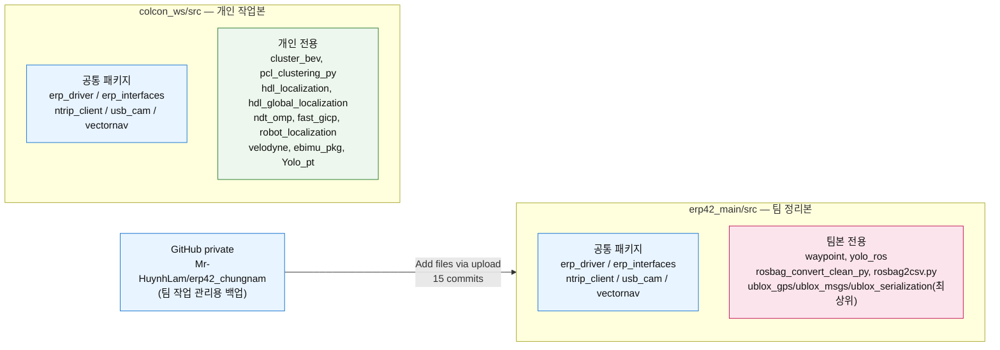

# colcon_ws vs erp42_main 비교

- **cwd(`/home/kimkh/colcon_ws/src`)**: 개인 작업 ws. ERP42 드라이버 스택 + LiDAR/localization 실험 패키지(hdl_localization, ndt_omp, fast_gicp, velodyne, pcl_clustering_py 등)가 섞여 있고, `erp_driver/scripts`에 날짜별 실험 스크립트(`0610_...`, `0702_...`, `0822_...` 등)가 그대로 쌓여 있음.
- **`erp42_main/`**: 최종본 ws. 실험 스크립트가 정리되어 파일명에서 날짜 prefix가 빠졌고, 파라미터 값들이 실차 튜닝값으로 갱신됨. LiDAR/localization 스택은 빠져 있고 대신 `waypoint`, `yolo_ros`, `rosbag_convert_clean_py` 같은 주행/후처리 도구가 추가됨. 패키지는 `erp42_main/src/` 하위에 위치(colcon 표준 레이아웃).
- **`erp42_main/`의 출처**: 원본은 GitHub private repo `Mr-HuynhLam/erp42_chungnam` — 실기 전체 ws를 올린 게 아니라 **팀 작업 관리용(파일 백업/공유)** repo. 따라서 "최종본"이라는 표현은 실기 배포 스냅샷이 아니라 "팀이 마지막으로 정리해서 올린 버전" 정도로 이해할 것.
- **담당 경계(🔵 추론 — 사용자 진술 근거, 2026-09-17)**: 이 문서 아래에 나오는 "실차 튜닝값" 변경들(`usb_cam` 카메라 device/해상도, `vectornav` `port`, `ntrip_client` `mountpoint`, `erp42_pathtracking.py`의 속도/`brake` 값 등)은 실기 테스트를 담당한 본인이 진행한 파라미터 튜닝이다. 모듈의 원 알고리즘 저자성과는 별개이며, 전체 담당 범위 표는 [`docs/portfolio/PORTFOLIO_SOURCE.md`](docs/portfolio/PORTFOLIO_SOURCE.md) §2가 단일 출처다.

## 왜 두 ws를 병렬로 관리하는가

- **`src/`(개인 작업 ws)**: 날짜별 실험 스크립트(`0610_...`~`0822_...`)와 LiDAR/localization 후보 스택(hdl_localization, ndt_omp, fast_gicp 등)이 정리되지 않은 채 그대로 쌓여 있다 — "무엇을 시도했는지"의 이력이 보존된 상태다. 이 상태로는 팀과 공유하기 어렵다(어느 variant가 최종인지 파일명만으로 구분 안 됨).
- **`erp42_main/`(팀 정리본)**: 팀원(`Mr-HuynhLam`)이 실차 튜닝값을 반영해 정리한 뒤 GitHub private repo에 백업 업로드한 것을 로컬로 가져온 사본이다 — 실기 전체 ws의 스냅샷이 아니라 **팀 작업 공유용으로 선별·정리된 부분집합**(§ 위 "`erp42_main/`의 출처" 참고). LiDAR/localization처럼 아직 팀 합의된 "최종"이 없는 영역은 애초에 이 repo에 올라가지 않았다.
- 즉 병렬 관리는 의도적 구조라기보다 **"개인 실험 이력(`src/`) vs 팀이 합의해서 공유한 부분집합(`erp42_main/`)"이라는, 실제 협업 과정에서 자연히 생긴 격차**다. 두 ws를 비교하면 "팀이 무엇을 최종으로 채택했는지"와 "개인이 무엇을 추가로 시도했는지"가 같이 보인다 — 이게 이 README를 diff 문서로 유지하는 이유다.

## 어디부터 봐야 하는가 (핵심 참조 패키지/파일)

두 ws 모두 `erp_driver/scripts/`가 실질적인 진입점이다. 아래는 파이프라인 순서대로 정렬했다 — 전체 담당 범위는 [`docs/portfolio/PORTFOLIO_SOURCE.md`](docs/portfolio/PORTFOLIO_SOURCE.md) §2가 단일 출처.

| 역할 | `src/` | `erp42_main/` | 담당(§2 기준) |
|---|---|---|---|
| Localization(EKF) | `erp_driver/scripts/1024_EBIMU_EKF.py` | `erp_driver/scripts/erp42_imu-gps-wheel-ekf_globalposition.py` | 팀 동료(구현) / 본인(실차 튜닝) |
| 차선 인식 | `erp_driver/scripts/0702_erp42_lanedetect.py` | `erp_driver/scripts/erp42_lanedetect.py`, `erp_driver/scripts/erp42_lanedetect_yolo.py`, `yolo_ros/` | 팀 동료(구현) / 본인(실차 튜닝) |
| LiDAR 장애물인식 | `pcl_clustering_py/`, `cluster_bev/`, `erp_driver/scripts/0724_*`~`0822_*` | *(패키지 자체 없음)* | **본인** |
| Pathtracking | `erp_driver/scripts/erp42_pathtracking.py` | `erp_driver/scripts/erp42_pathtracking.py` | **본인** |
| Command 중재(Controller) | `erp_driver/scripts/0702_erp42_controller.py` | *(파일 자체 없음 — pathtracking이 직접 발행)* | **본인** |
| Actuation | `erp_driver/scripts/erp42_serial.py` | `erp_driver/scripts/erp42_serial.py` | **본인** |

## 코드 연결관계 (요약)

```
GPS/IMU/encoder → EKF(localization) → pathtracking → [src만: Controller 중재(lane/path)] → serial → 액추에이터
                                            ↑                                    │
                            camera → 차선 인식 ──┘(src: Controller 경유 / main: 구독자 없어 dead)
                            LiDAR → 장애물 인식 ──(양쪽 다 pathtracking 진입 조건 dead branch)
```

- `src/`는 pathtracking → Controller(lane/path 중재) → serial 순서, `erp42_main/`은 Controller 없이 pathtracking이 serial에 직접 발행 — 이 차이가 두 ws의 가장 큰 아키텍처 세대 차이다.
- 카메라→차선 인식, LiDAR→pathtracking 두 경로는 topic 이름 불일치·미발행 조건 때문에 **정적으로는 dead**다(코드는 있으나 실행 경로로 연결 안 됨).
- 이 요약은 방향성만 보여주기 위한 것이고, topic별 파일:라인 근거·모든 dead branch 표는 [`docs/portfolio/architecture.md`](docs/portfolio/architecture.md)가 단일 출처다.

## Workspace 패키지 구조



> 상세 sensor→localization→perception→decision→control **데이터 흐름 다이어그램**(topic 단위, publisher/subscriber 파일:라인 근거·dead branch 포함)은 이 다이어그램의 상위 확장이 아니라 별도 검증 문서 [`docs/portfolio/architecture.md`](docs/portfolio/architecture.md)가 단일 출처다 — 내용이 자주 바뀌는 문서라 여기에 복사하지 않는다.

## 공통 패키지 차이

### erp_driver
- **scripts 정리**: cwd에는 `0610_erp42_imu-gps-wheel-ekf_globalposition.py`, `0702_erp42_lanedetect.py`, `0822_Ob_bangbang3d.py` 등 날짜 prefix가 붙은 반복 실험본 17개가 남아 있음. erp42_main은 이 중 최종 채택분만 날짜 prefix를 떼고 유지(`erp42_imu-gps-wheel-ekf_globalposition.py`, `erp42_lanedetect.py`, `erp42_lanedetect_yolo.py`) — 나머지 실험 스크립트(장애물 회피, LiDAR 관련 등)는 전부 삭제됨.
- **`erp42_pathtracking.py`** 튜닝값 변경:
  - publish 토픽: `/erp42_ctrl_cmd/path` → `/erp42_ctrl_cmd`
  - 속도: 하드코딩 `15` → `self.max_linear_speed` (파라미터화)
  - `brake`: `2` → `1`
- `waypoints_real_*.xls` 등 waypoint 데이터 파일은 erp42_main에서 별도 `waypoint/` 패키지로 이동.
- `package.xml`, `setup.py`는 동일.

### erp_interfaces
- 완전 동일 (diff 없음).

### ntrip_client
- `ntrip_client_launch.py`의 `mountpoint` 기본값만 변경: `RTK-RTCM32` → `RTK-RTCM31`.

### usb_cam
- `params_1.yaml`: 카메라 장치·해상도·자동노출 설정이 실차 카메라에 맞게 변경 (`/dev/video0`→`/dev/video2`, `mjpeg2rgb`→`yuyv2rgb`, `640x640`→`640x480`, auto_white_balance/autoexposure `true`→`false`).
- `params_2.yaml`: 카메라 장치 변경(`/dev/video2`→`/dev/video4`), 해상도(`640x360`→`768x480`), pixel_format(`mjpeg2rgb`→`yuyv`), YAML 들여쓰기 스타일도 다름(4-space→2-space 계열).
- erp42_main에 `params_3.yaml`, `params_4.yaml` 카메라 설정 추가(cwd에는 없음) — 카메라가 2대→4대로 늘어난 것으로 추정.
- launch 파일명 변경: `2camera.launch.py`(cwd) → `camera2.launch.py`(erp42_main).
- cwd 쪽에만 upstream 저장소 부산물(`.github`, `docs/`, `.gitignore`)과 `Pick_Tray_SA.py`가 남아 있음 — erp42_main은 이를 정리한 상태.

### vectornav
- **패키지 구조 자체가 다름**: cwd(`src/vectornav`)는 upstream `dawonn/vectornav` ROS2 드라이버 repo 그대로(하위에 `vectornav/`, `vectornav_msgs/` 두 개의 서브패키지 + `.git`, `README.md`, `LICENCE` 포함).
- erp42_main(`erp42_main/src/vectornav`)은 cwd의 `vectornav/vectornav` 서브패키지를 그대로 최상위로 끌어올린 것 — `CMakeLists.txt`/`package.xml` diff 결과 **완전 동일**, `config/vectornav.yaml`, `launch/` 등도 `port` 파라미터 1줄 외엔 동일. 즉 코드 로직 차이는 없고 배치(위치)만 다름.
- 값 차이: `config/vectornav.yaml`의 `port`가 `/dev/ttyUSB2`(cwd) → `/dev/ttyUSB0`(erp42_main)로 실차 설정 변경.
- ✅ **조치 완료 (2026-08-20)**: `vectornav_msgs` 패키지가 없어 `find_package(... REQUIRED)`가 실패하던 문제 — `src/vectornav/vectornav_msgs`를 `erp42_main/src/vectornav_msgs`로 복사해서 해소.
- ✅ **조치 완료 (2026-08-20)**: erp42_main에 `src/` 래퍼가 없어 colcon 기본 스캔 경로(`<ws>/src`)와 어긋나던 문제 — 전 패키지를 `erp42_main/src/` 하위로 이동. 현재 `erp42_main/README.md`, `erp42_main/src/*` 구조로 정리됨.

## cwd 전용 패키지 (erp42_main에는 없음)
LiDAR·localization 관련 스택으로, ERP42 최종본에는 아직 반영되지 않은 개인 실험 영역으로 보임.
- `cluster_bev`, `pcl_clustering_py` — PCL 기반 클러스터링
- `hdl_localization`, `hdl_global_localization`, `ndt_omp`, `fast_gicp` — NDT/GICP 기반 localization 스택
- `robot_localization` — EKF/UKF 센서 퓨전
- `velodyne` — Velodyne LiDAR 드라이버
- `ebimu_pkg` — EBIMU 드라이버
- `Yolo_pt` — YOLO 가중치(`best.pt`, `last.pt`) 저장용

## erp42_main 전용 패키지 (cwd에는 없음)
- `waypoint` — cwd `erp_driver/scripts`에 있던 waypoint 데이터 파일(`.xls`)을 분리한 패키지
- `yolo_ros` — YOLO 추론 ROS2 래퍼 (+ `best_lane_yolov11.pt` 가중치, cwd의 `Yolo_pt`와 역할 겹침)
- `rosbag_convert_clean_py`, `rosbag2csv.py` — rosbag 후처리/변환 도구
- `ublox_gps`, `ublox_msgs`, `ublox_serialization`이 최상위에 개별 디렉터리로 존재 — cwd는 이 셋이 `ublox/` 하위 서브패키지로 묶여 있음(내용은 동일, 배치만 다름)

## 원본 GitHub repo 커밋 이력 검증 (완료, 로컬 clone은 삭제됨)
`erp42_main/`이 어디서 왔는지 확인하려고 원본 repo(`https://github.com/Mr-HuynhLam/erp42_chungnam`, private)를 임시로 로컬 clone해서 대조한 뒤, 확인이 끝나 **삭제함**(작업 관리용 repo일 뿐 실기 전체 ws가 아니라는 걸 사용자가 확인해줌 — 다른 사람 소유의 private repo라 로컬에도 남겨두지 않음, push/외부 공유도 하지 않았음).

- 커밋 15개, 전부 GitHub 웹 업로드(`Add files via upload`) — 커밋 메시지에 의미 있는 정보 없음. 기간: 2025-06-02 (Initial commit) ~ 2025-08-08 (최신).
- **pristine clone 구조가 (수정 전) `erp42_main/`과 100% 동일**: 패키지가 루트에 바로 있고 `src/` 래퍼 없음, `vectornav_msgs` 없음. → 즉 이번 대화 초반에 지적한 "🔴 vectornav_msgs 누락으로 빌드 실패 확정" 문제와 "src 래퍼 부재" 문제는 **내 zip 추출 과정의 실수가 아니라 원본 GitHub repo 자체의 상태**였음을 커밋 이력으로 확인함 (검증됨, clone 삭제 전에 확보한 사실).
- `vectornav/package.xml`은 2025-06-03 커밋(`f20c862`)에서 처음 추가됐고, 그 커밋에서도 `vectornav_msgs`는 함께 올라오지 않음 — 처음부터 이 의존성이 누락된 채로 올라온 것으로 보임.
- **팀 작업 관리용 repo**(사용자 확인): 실기에 배포된 전체 ws의 스냅샷이 아니라, 파일 백업/공유 목적의 업로드. 즉 이 repo에 없는 것(예: `vectornav_msgs`, `src/` 구조)이 "실기에서도 없다"는 뜻은 아니고, 실기 ws는 별도로 존재할 가능성이 있음 — `erp42_main`/`erp42_chungnam`을 실기의 authoritative 상태로 취급하지 말 것.

## 확신도
확신도: 검증됨 (git log/diff, find로 실제 확인) — 단 원작성자의 의도(왜 vectornav_msgs를 안 올렸는지 등)는 추론.
내가 채워넣은 가정:
1. erp42_main이 이 GitHub repo에서 파생된 최종본이라는 전제
2. vectornav_msgs 누락이 실수(누락)이지 의도적 축소가 아니라고 추정
확인 요청: 없음 (커밋 이력으로 기존 가정들이 확인/해소됨)
