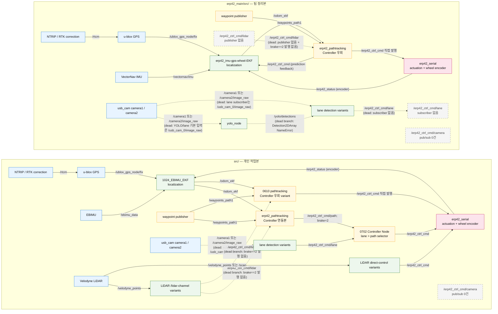

# ERP42 ROS 2 정적 topic architecture

> 범위: `src/`(개인 작업본)와 `erp42_main/src/`(팀 정리본)의 source/launch/config 정적 분석.  
> 실선은 같은 topic의 publisher와 subscriber가 양쪽 코드에 존재한다는 뜻이다. 실제로 두 노드가 같은 run에서 함께 launch됐다는 뜻은 아니다. 점선은 dead topic, topic mismatch, 또는 코드상 trigger 불가능 분기다. 서비스(`/set_origin`)와 파일 입력(waypoint `.xls`)은 ROS topic edge가 아니므로 그래프 edge에서 제외했다.

## Architecture graph



## Edge evidence

경로는 repository root 기준이다. `— (rg 0건)`은 해당 endpoint가 없다는 음성 근거이며 점선 사유 중 하나다. 양쪽 endpoint가 있어도 topic mismatch, 시작 전 예외, trigger 불가능 조건이면 점선이다.

| Edge | 발행 파일:라인 | 구독 파일:라인 | 상태 |
|---|---|---|---|
| 개인 RTK client → u-blox (`/rtcm`) | `src/ntrip_client/scripts/ntrip_ros_base.py:78` | `src/ublox/ublox_gps/src/node.cpp:502` | 실선 — pub/sub 존재; NTRIP launch 기본 namespace는 `/` (`src/ntrip_client/launch/ntrip_client_launch.py:10,34`) |
| 개인 u-blox → EBIMU EKF (`/ublox_gps_node/fix`) | `src/ublox/ublox_gps/include/ublox_gps/ublox_firmware7plus.hpp:41-42` | `src/erp_driver/scripts/1024_EBIMU_EKF.py:63` | 실선 — u-blox executable 이름으로 private `~/fix`가 `/ublox_gps_node/fix`가 됨 (`src/ublox/ublox_gps/launch/ublox_gps_node-launch.py:47-50`) |
| 개인 EBIMU → EBIMU EKF (`/ebimu_data`) | `src/ebimu_pkg/ebimu_pkg/ebimu_publisher.py:30` | `src/erp_driver/scripts/1024_EBIMU_EKF.py:62` | 실선 |
| 개인 ERP42 wheel encoder → EBIMU EKF (`/erp42_status`) | `src/erp_driver/scripts/erp42_serial.py:24,37,57` | `src/erp_driver/scripts/1024_EBIMU_EKF.py:61,105-114` | 실선 — `ErpStatusMsg.encoder` 사용 확인 |
| 개인 EBIMU EKF → pathtracking (`/odom_ekf`) | `src/erp_driver/scripts/1024_EBIMU_EKF.py:64` | `src/erp_driver/scripts/erp42_pathtracking.py:35-39` | 실선 |
| 개인 waypoint publisher → pathtracking (`/waypoints_path1`) | `src/erp_driver/scripts/erp42_pubwaypointscnuservice_pymap3d.py:19` | `src/erp_driver/scripts/erp42_pathtracking.py:41-45` | 실선 |
| 개인 EBIMU EKF → 0610 pathtracking variant (`/odom_ekf`) | `src/erp_driver/scripts/1024_EBIMU_EKF.py:64` | `src/erp_driver/scripts/0610_erp42_pathtracking.py:35-39` | 실선 |
| 개인 waypoint publisher → 0610 pathtracking variant (`/waypoints_path1`) | `src/erp_driver/scripts/erp42_pubwaypointscnuservice_pymap3d.py:19` | `src/erp_driver/scripts/0610_erp42_pathtracking.py:41-45` | 실선 |
| 개인 camera1/2 → lane detector (image) | `src/usb_cam/src/usb_cam_node.cpp:37,47-49`; remap `src/usb_cam/launch/camera_config.py:57-63`; camera 선택 `src/usb_cam/launch/camera.launch.py:49-54`, `src/usb_cam/launch/2camera.launch.py:49-54` | `src/erp_driver/scripts/0702_erp42_lanedetect.py:366-368` | **점선 — dead topic mismatch:** 발행은 `/camera1/image_raw` 또는 `/camera2/image_raw`, 구독은 `/usb_cam_0/image_raw` |
| 개인 lane detector → Controller (`/erp42_ctrl_cmd/lane`) | `src/erp_driver/scripts/0702_erp42_lanedetect.py:368`; YOLO variants `src/erp_driver/scripts/0610_erp42_lanedetect_yolo.py:26`, `0702_erp42_lanedetect_yolo.py:26` | `src/erp_driver/scripts/0702_erp42_controller.py:18-19` | 실선 — topic endpoint 기준. 단 detector 입력의 생존 여부는 별도 점선으로 표시 |
| 개인 Velodyne → `/lidar`-channel variants (`/velodyne_points`) | `src/velodyne/velodyne_pointcloud/src/conversions/transform.cpp:121` | `src/erp_driver/scripts/0724_erp42_3DObstacle_Lam.py:13`, `src/erp_driver/scripts/0822_Obstacle_3d.py:17` | 실선 — sensor input topic의 pub/sub 존재 |
| 개인 `/lidar`-channel variants → pathtracking (`/erp42_ctrl_cmd/lidar`) | `src/erp_driver/scripts/0724_erp42_3DObstacle_Lam.py:12`, `src/erp_driver/scripts/0804_LiDAR_Avoidance.py:13`, `src/erp_driver/scripts/0822_Obstacle_3d.py:14` | `src/erp_driver/scripts/erp42_pathtracking.py:47-50`; 조건 `:142` | **점선 — dead branch:** 세 publisher의 brake 값은 각각 `155/0` (`0724...:34,39`), `0` (`0804...:60`), `200/0` (`0822...:69,117`)이며 `brake==2`가 없음. `0804...:12`는 입력 topic에도 공백 오타(`/velo dyne_points`)가 있음 |
| 개인 `/lidar`-channel variants → 0610 pathtracking variant (`/erp42_ctrl_cmd/lidar`) | `src/erp_driver/scripts/0724_erp42_3DObstacle_Lam.py:12`, `src/erp_driver/scripts/0804_LiDAR_Avoidance.py:13`, `src/erp_driver/scripts/0822_Obstacle_3d.py:14` | `src/erp_driver/scripts/0610_erp42_pathtracking.py:47-50`; 조건 `:142` | **점선 — dead branch:** `/lidar` publisher 어느 것도 `brake=2`를 발행하지 않음 |
| 개인 Velodyne → direct-control LiDAR variants (`/velodyne_points`, `/scan`) | point cloud `src/velodyne/velodyne_pointcloud/src/conversions/transform.cpp:121`; scan `src/velodyne/velodyne_laserscan/src/velodyne_laserscan.cpp:76-79` | point cloud `src/erp_driver/scripts/0822_Lam_ObtAvo.py:84-85`, `0822_Ob_bangbang3d.py:17`; scan `0724_erp42_ObstacleAvoidance.py:12`, `0822_ObstackeaAv_2d.py:16` | 실선 — 여러 실험 variant; 동시 실행을 의미하지 않음 |
| 개인 direct-control LiDAR variants → ERP serial (`/erp42_ctrl_cmd`) | `src/erp_driver/scripts/0822_Lam_ObtAvo.py:87-89`, `0822_Ob_bangbang3d.py:14`, `0724_erp42_ObstacleAvoidance.py:11`, `0822_ObstackeaAv_2d.py:13` | `src/erp_driver/scripts/erp42_serial.py:25` | 실선 — Controller를 거치지 않는 대안/실험 경로 |
| 개인 pathtracking → Controller (`/erp42_ctrl_cmd/path`) | `src/erp_driver/scripts/erp42_pathtracking.py:53-56,189-190` | `src/erp_driver/scripts/0702_erp42_controller.py:16-17`; 유효 조건 `:40` | 실선 — pathtracking이 `brake=2`를 내고 Controller의 `path_valid`와 맞물림 |
| 개인 0610 pathtracking variant → ERP serial (`/erp42_ctrl_cmd`) | `src/erp_driver/scripts/0610_erp42_pathtracking.py:53-56,189-190` | `src/erp_driver/scripts/erp42_serial.py:25` | 실선 — 개인본 안에도 Controller를 우회하는 날짜-prefix 대안 경로가 있음 |
| 개인 Controller → ERP serial (`/erp42_ctrl_cmd`) | `src/erp_driver/scripts/0702_erp42_controller.py:20-21,58` | `src/erp_driver/scripts/erp42_serial.py:25` | 실선 |
| 팀 RTK client → u-blox (`/rtcm`) | `erp42_main/src/ntrip_client/scripts/ntrip_ros_base.py:78` | `erp42_main/src/ublox_gps/src/node.cpp:502` | 실선 — launch 기본 namespace `/` (`erp42_main/src/ntrip_client/launch/ntrip_client_launch.py:10,34`) |
| 팀 u-blox → EKF (`/ublox_gps_node/fix`) | `erp42_main/src/ublox_gps/include/ublox_gps/ublox_firmware7plus.hpp:41-42` | `erp42_main/src/erp_driver/scripts/erp42_imu-gps-wheel-ekf_globalposition.py:70` | 실선 — node executable `ublox_gps_node` (`erp42_main/src/ublox_gps/launch/ublox_gps_node-launch.py:47-50`) |
| 팀 VectorNav → EKF (`/vectornav/imu`) | `erp42_main/src/vectornav/src/vn_sensor_msgs.cc:49` | `erp42_main/src/erp_driver/scripts/erp42_imu-gps-wheel-ekf_globalposition.py:69` | 실선 |
| 팀 ERP42 wheel encoder → EKF (`/erp42_status`) | `erp42_main/src/erp_driver/scripts/erp42_serial.py:24,37,57` | `erp42_main/src/erp_driver/scripts/erp42_imu-gps-wheel-ekf_globalposition.py:68,112-121` | 실선 — `ErpStatusMsg.encoder` 사용 확인 |
| 팀 EKF → pathtracking (`/odom_ekf`) | `erp42_main/src/erp_driver/scripts/erp42_imu-gps-wheel-ekf_globalposition.py:71` | `erp42_main/src/erp_driver/scripts/erp42_pathtracking.py:35-39` | 실선 |
| 팀 waypoint publisher → pathtracking (`/waypoints_path1`) | `erp42_main/src/erp_driver/scripts/erp42_pubwaypointscnuservice_pymap3d.py:19` | `erp42_main/src/erp_driver/scripts/erp42_pathtracking.py:41-45` | 실선 |
| 팀 pathtracking → ERP serial (`/erp42_ctrl_cmd`) | `erp42_main/src/erp_driver/scripts/erp42_pathtracking.py:53-56,189-190` | `erp42_main/src/erp_driver/scripts/erp42_serial.py:25` | 실선 — 개인본의 `/path → Controller`와 달리 최종 command를 직접 발행 |
| 팀 pathtracking → EKF prediction feedback (`/erp42_ctrl_cmd`) | `erp42_main/src/erp_driver/scripts/erp42_pathtracking.py:53-56,189-190` | `erp42_main/src/erp_driver/scripts/erp42_imu-gps-wheel-ekf_globalposition.py:67` | 실선 — control command feedback edge |
| 팀 camera1/2 → YOLO image input | `erp42_main/src/usb_cam/src/usb_cam_node.cpp:37,47-49`; remap `erp42_main/src/usb_cam/launch/camera_config.py:57-63`; camera 선택 `erp42_main/src/usb_cam/launch/camera.launch.py:49-54`, `erp42_main/src/usb_cam/launch/camera2.launch.py:49-54` | YOLO default/remap `erp42_main/src/yolo_ros/yolo_bringup/launch/yolo.launch.py:137-141,253` | **점선 — dead topic mismatch:** 발행은 `/camera1/image_raw` 또는 `/camera2/image_raw`, 기본 입력은 `/usb_cam_0/image_raw` |
| 팀 camera1/2 → direct lane detector image input | `erp42_main/src/usb_cam/src/usb_cam_node.cpp:37,47-49`; remap `erp42_main/src/usb_cam/launch/camera_config.py:57-63`; camera 선택 `erp42_main/src/usb_cam/launch/camera.launch.py:49-54`, `erp42_main/src/usb_cam/launch/camera2.launch.py:49-54` | `erp42_main/src/erp_driver/scripts/erp42_lanedetect.py:329-331` | **점선 — dead topic mismatch:** 발행은 `/camera1/image_raw` 또는 `/camera2/image_raw`, 구독은 `/usb_cam_0/image_raw` |
| 팀 YOLO → YOLO lane node (`/yolo/detections`) | `erp42_main/src/yolo_ros/yolo_ros/yolo_ros/yolo_node.py:122`; namespace `erp42_main/src/yolo_ros/yolo_bringup/launch/yolo.launch.py:203-206,229-234` | `erp42_main/src/erp_driver/scripts/erp42_lanedetect_yolo.py:20-23` | **점선 — dead branch:** subscriber type으로 미정의 `Detection2DArray`를 사용(`:21`); import된 type은 `DetectionArray`(`:8`)라 노드 생성 시 `NameError` |
| 팀 lane nodes → lane sink (`/erp42_ctrl_cmd/lane`) | `erp42_main/src/erp_driver/scripts/erp42_lanedetect.py:331`, `erp42_lanedetect_yolo.py:26` | — (`erp42_main/src/`에서 subscriber rg 0건) | **점선 — dead topic:** publisher만 있고 subscriber 없음 |
| 팀 LiDAR command source → pathtracking (`/erp42_ctrl_cmd/lidar`) | — (`erp42_main/src/`에서 publisher rg 0건) | `erp42_main/src/erp_driver/scripts/erp42_pathtracking.py:47-50`; 조건 `:142` | **점선 — dead topic/dead branch:** 팀본에 publisher가 없고, 두 트리의 `/lidar` publisher 어느 것도 `brake=2`를 발행하지 않음 |

## Camera launch 확인

- 개인본: `camera.launch.py`가 camera1 + `params_1.yaml`, `2camera.launch.py`가 camera2 + `params_2.yaml`을 각각 구성한다. camera3/4 launch는 없다.
- 팀본: `camera.launch.py`가 camera1 + `params_1.yaml`, `camera2.launch.py`가 camera2 + `params_2.yaml`을 각각 구성한다. `params_3.yaml`, `params_4.yaml`은 존재하지만 이를 참조하는 launch가 없다.
- 따라서 mission-cards의 “camera1/camera2만 launch 배선, camera3/4는 고아 설정”과 일치한다. 다만 camera1/2의 발행 topic도 현재 lane/YOLO 기본 입력과 이름이 맞지 않아 perception까지의 연결은 점선이다.

## 명시적으로 확인한 dead path

- `/erp42_ctrl_cmd/camera`: 두 source tree 전체에서 publisher/subscriber 모두 0건이다. 그래프에는 연결 edge 없이 dead node로만 표시했다.
- 개인본 `/erp42_ctrl_cmd/lane`: publisher와 `0702_erp42_controller.py` subscriber가 모두 있어 topic 자체는 live endpoint다.
- 팀본 `/erp42_ctrl_cmd/lane`: publisher만 있고 subscriber가 없어 dead topic이다.
- `/erp42_ctrl_cmd/lidar`의 `brake==2`: 개인본의 pathtracking이 자기 `/path` command에 `brake=2`를 넣는 것은 LiDAR publisher 근거가 아니다. `/lidar`를 발행하는 세 파일은 `2`를 발행하지 않으므로 두 pathtracking 파일의 LiDAR 조건은 trigger될 수 없다.
- 동일한 unprefixed 파일끼리 비교하면 개인본 pathtracking은 `/path → 0702 Controller`로 연결되고 팀본은 `/erp42_ctrl_cmd`를 직접 발행한다. 팀본에는 `0702_erp42_controller.py`가 없으며 `/erp42_ctrl_cmd/path` publisher/subscriber도 없다. 개인본의 날짜-prefix `0610_erp42_pathtracking.py`는 별도의 Controller 우회 variant로 그래프에 함께 표시했다.

## 전체 Python `create_*` 조사에서 그래프 밖으로 분리한 topic

아래는 grep/AST 전수 수집에는 포함됐지만, 요청된 ERP42 sensor→localization/perception→decision→control 경로에 이어지는 근거가 없어 그래프 edge로 승격하지 않은 항목이다.

| Topic / 호출 | 확인 위치 | 제외 이유 |
|---|---|---|
| 개인 `cmd_vel` | `src/erp_driver/scripts/0730_LiDAR_ObjectDetect.py:16` | publisher만 있고 두 tree에서 consumer를 찾지 못함 |
| 개인 `/odom_ekf_global` | `src/erp_driver/scripts/0707_erp42_imu-gps-wheel-ekf_globalposition.py:82` | publisher만 있고 consumer 없음 |
| 양쪽 `/vectornav/imu_offset` | 각 `erp_driver/scripts/imu-offset.py:18` | publisher는 있으나 EKF는 원본 `/vectornav/imu`를 구독 |
| 양쪽 `/odometry/local` → `/odometry/local1` | 각 `erp_driver/scripts/global_rotate.py:12,18` | upstream publisher와 downstream consumer가 함께 확인되지 않음 |
| 개인 `/clustered_points`, `/clusters_bev` | `src/pcl_clustering_py/pcl_clustering_py/euclidean_cluster_node.py:37`, `src/cluster_bev/src/cluster_bev_node.cpp:49` | 후속 decision/control subscriber 근거 없음 |
| 양쪽 `nmea` | `src/ntrip_client/scripts/ntrip_ros_base.py:100`, `erp42_main/src/ntrip_client/scripts/ntrip_ros_base.py:100`; u-blox publisher는 `src/ublox/ublox_gps/src/node.cpp:496-498`, `erp42_main/src/ublox_gps/src/node.cpp:496-498` | RTK 보조 입력이나 최종 control graph에는 `/rtcm` correction edge만 표시 |
| usb_cam `show_image.py`의 상대 topic `image_raw` | 각 `usb_cam/scripts/show_image.py:46-48` | debug viewer이며 ERP42 decision/control 경로가 아님 |
| 개인 `Pick_Tray_SA.py`의 `/hand_*` | `src/usb_cam/launch/Pick_Tray_SA.py:260-262` | ERP42 주행 architecture와 무관한 별도 application |
| 팀 YOLO debug/tracking/3D output | `erp42_main/src/yolo_ros/yolo_ros/yolo_ros/tracking_node.py:63`, `erp42_main/src/yolo_ros/yolo_ros/yolo_ros/detect_3d_node.py:107`, `erp42_main/src/yolo_ros/yolo_ros/yolo_ros/debug_node.py:70-72` | ERP42 command consumer로 이어지는 subscriber 근거 없음 |

## 미확인 연결

- 두 tree 모두 전체 autonomy stack을 한 번에 기동하는 top-level launch가 없다. 따라서 어떤 실험 variant들이 실제 한 run에서 동시에 실행됐는지는 source만으로 확정할 수 없다.
- camera1과 camera2 중 어느 physical camera가 신호등/정지선/차선을 담당했는지는 config/launch에서 확인되지 않는다.
- `/usb_cam_0/image_raw`를 만들어 주는 별도 CLI remap 또는 외부 launch 근거를 찾지 못했다. 그 연결은 그래프에 실선으로 넣지 않았다.
- 개인본의 YOLO lane scripts가 구독하는 `/yolo/detections` publisher는 `src/` 내부에서 찾지 못했다. 팀본 `erp42_main/src/yolo_ros`를 개인 workspace와 함께 overlay했는지는 확인할 수 없어 개인 subgraph에서 제외했다.
- 팀본에는 Velodyne driver와 `/erp42_ctrl_cmd/lidar` publisher가 없다. 외부 workspace가 이를 공급했는지는 확인할 수 없어 팀 LiDAR 연결은 dead edge로만 표시했다.
- runtime `ros2 topic info`, QoS compatibility, 실제 sensor 연결 및 hardware actuation은 수행하지 않았다.

## 검증 방법

실행한 핵심 명령(경로는 `/home/kimkh/colcon_ws` 기준)이다. AST 전수 검사는 parse error 없이 개인본 31개 파일/71개 호출, 팀본 16개 파일/34개 호출을 수집했다.

```bash
wc -l docs/portfolio/mission-cards.md
sed -n '1,260p' docs/portfolio/mission-cards.md
sed -n '261,520p' docs/portfolio/mission-cards.md
rg -n -U "(?:self\\.)?create_(publisher|subscription)\\s*\\(" src erp42_main/src --glob '*.py'
rg -n "create_publisher|create_subscription" src/erp_driver/scripts/*.py erp42_main/src/erp_driver/scripts/*.py
python3 - <<'PY'
import ast
from pathlib import Path
for root in (Path('src'), Path('erp42_main/src')):
    for p in sorted(root.rglob('*.py')):
        tree = ast.parse(p.read_text(errors='replace'))
        for node in ast.walk(tree):
            if not isinstance(node, ast.Call):
                continue
            func = node.func
            name = func.attr if isinstance(func, ast.Attribute) else (
                func.id if isinstance(func, ast.Name) else '')
            if name not in {'create_publisher', 'create_subscription'}:
                continue
            topic = ast.unparse(node.args[1]) if len(node.args) > 1 else '?'
            print(p, node.lineno, name, topic, sep='\t')
PY
rg -n "camera[1-4]|usb_cam|image_raw|video_device" src erp42_main/src --glob '*.{py,launch.py,yaml,yml,xml}'
find src/usb_cam/launch erp42_main/src/usb_cam/launch -maxdepth 1 -type f -name '*.launch.py'
rg -n "erp42_ctrl_cmd/camera" src erp42_main/src
rg -n "erp42_ctrl_cmd/lane" src erp42_main/src --glob '*.{py,cpp,hpp,h,launch.py,yaml,yml}'
rg -n "brake\\s*=\\s*2|brake\\s*==\\s*2" src/erp_driver/scripts erp42_main/src/erp_driver/scripts
rg -n "velodyne_points|create_camera_publisher|create_publisher.*fix|create_subscription.*rtcm|pub_imu_" src erp42_main/src --glob '*.{py,cpp,hpp,h,launch.py,yaml,yml}'
```
