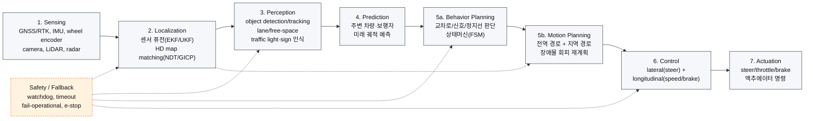

# 일반적 자율주행 E2E 파이프라인 대비 ERP42 패키지 Gap 분석

> 목적: "센서 → 인지 → 판단 → 제어"로 대표되는 일반적인 차량 자율주행 end-to-end 구성을 기준선(reference)으로 놓고, `colcon_ws/src`(개인 작업본)와 `erp42_main/`(팀 정리본)이 그 기준선의 어느 축을 채우고 어느 축이 비어있는지 정리한다.
> 하위 topic 단위 publisher/subscriber 근거·dead branch 상세 표는 이 문서가 아니라 [`architecture.md`](architecture.md)가 단일 출처다 — 여기서는 그 결과를 파이프라인 단계별로 재배치해서 "무엇이 빠졌는지"만 본다. 패키지 목록 자체는 [`../../README.md`](../../README.md)를 참고.

## 1. 일반적 자율주행 E2E 파이프라인 (기준선, 예시)

이 섹션은 ERP42 코드와 무관한 **일반 참고 모델**이다 — 업계에서 흔히 쓰는 Sense–Plan–Act 5~7단계 구성(Autoware/Apollo류 아키텍처에서 공통적으로 등장하는 스테이지)을 예시로 든 것이며, 실차 구현을 서술하는 게 아니다.

## 2. 단계별 Gap 표

범례: ✅ 배선되어 동작 확인(코드상 live edge) · ⚠️ 코드는 있으나 미배선/dead branch/부분적 · ❌ 해당 축 자체가 없음

| 단계 | 일반적 구성요소(예시) | `colcon_ws/src` | `erp42_main/` | 근거 |
|---|---|---|---|---|
| Sensing | GNSS/RTK, IMU, encoder, camera, LiDAR | ✅ 전체 센서 보유(RTK, u-blox, EBIMU, camera×2, Velodyne) | ⚠️ LiDAR 드라이버 패키지 자체가 없음(Velodyne 미포함), 나머지는 보유(VectorNav IMU로 교체) | `architecture.md` sensor subgraph; `ls erp42_main/src`에 velodyne 없음(2026-09-17 확인) |
| Localization | 센서 퓨전(EKF/UKF) + map matching(NDT/GICP) | ⚠️ custom 선형 EKF는 배선·동작(`erp42_ebimu_ekf_globalposition.py`) ✅. `hdl_localization`/`ndt_omp`/`fast_gicp`/`robot_localization` 패키지는 존재하나 launch/코드 어디서도 참조 근거 0건 — **빌드만 되는 미배선 코드** | ⚠️ 동일 패턴 custom EKF(`erp42_imu-gps-wheel-ekf_globalposition.py`) ✅. NDT/GICP 계열 패키지 자체가 없음(팀본에서 통째로 제외) | EKF edge: `architecture.md` P_EKF/M_EKF; NDT/GICP 미참조: `rg -rln "hdl_localization\|ndt_omp\|fast_gicp" src --include=*.py --include=*.launch.py --include=*.xml` 0건(2026-09-17 실행 확인) |
| Perception — lane | HSV/딥러닝 차선 인식 | ⚠️ 코드 존재(`0702_erp42_lanedetect.py` + YOLO variant)하나 카메라 publish topic(`/camera1,2/image_raw`)과 구독 topic(`/usb_cam_0/image_raw`) 불일치로 **입력 자체가 dead** | ⚠️ 동일 topic mismatch로 dead. 추가로 YOLO→lane 파이프라인이 `Detection2DArray`(미정의) 구독 vs `DetectionArray`(실제 import) 불일치로 **NameError 발생 확정** — 이중 dead | `architecture.md` Edge evidence 표(camera→lane, YOLO→lane 행) |
| Perception — 장애물(LiDAR/3D) | LiDAR/radar 기반 object detection | ⚠️ 여러 실험 variant 존재. 일부는 pathtracking에 연결되나 `brake==2` 조건이 어떤 publisher도 발행하지 않아 트리거 불가(dead branch), 일부는 Controller/pathtracking을 우회해 serial에 직접 명령(구조적으로 lane/path 제어와 경합 위험) | ❌ `velodyne`/`cluster_bev`/`pcl_clustering_py` 패키지 자체가 없음 — **장애물 인지 축이 전혀 없음** | `architecture.md` `/erp42_ctrl_cmd/lidar` 행(개인/팀 공통 dead); `ls erp42_main/src`에 해당 패키지 부재 |
| Perception — 신호등/표지판 | traffic light/sign 인식 | ❌ 코드 근거 없음 | ❌ 코드 근거 없음. `erp42_pathtracking_lidar_integrated.py`가 원본 파일명(`trafficlight_stop_ros2.py`)만 신호등을 암시할 뿐 실제 내용은 LiDAR sector 회피 로직 — 신호등 인식 아님 | `rg -rniE "traffic|signal|sign_" src/erp_driver/scripts erp42_main/src/erp_driver/scripts` 0건에 가까움(파일 헤더 주석 1건 외); 해당 파일 자체 주석에 "신호등 로직은 전혀 없음"이라 명시(2026-08-21 발견 당시 기록) |
| Prediction | 주변 차량/보행자 궤적 예측 | ❌ 없음 | ❌ 없음 | 두 tree 모두 prediction류 패키지/모듈 없음(패키지 목록 전수 확인) |
| Planning — Behavior | 규칙기반/FSM 상태 판단(교차로, 신호, 정지선) | ⚠️ `erp42_controller.py`가 lane/path 우선순위 selector 역할(0.2s timeout 기반 valid 판정) — 축소된 behavior layer | ❌ 이 Controller Node 자체가 팀본에는 없음(파일 삭제) — pathtracking이 serial에 직접 발행, **behavior/selection 레이어 없음, 항상 waypoint 추종만** | `architecture.md`의 P_CTRL 노드(cwd에만 존재) vs M 서브그래프에 대응 노드 없음; `erp42_controller.py:39-40` timeout/valid 로직 |
| Planning — Motion(전역/지역) | 전역 경로 + 장애물 반영 지역 재계획 | ⚠️ waypoint publisher가 정적 `.xls` 경로만 발행(전역 경로 고정) — 장애물 회피 결과를 반영하는 지역 재계획 없음. `erp42_pathtracking_lidar_integrated.py`(LiDAR 통합 시도)가 있으나 `setup.py` entry_points에 미등록·어느 launch에도 미배선·미검증 | ⚠️ 동일하게 정적 전역 경로만, 지역 재계획 없음 | waypoint: `erp42_pubwaypointscnuservice_pymap3d.py`; 미배선 확인: `grep lidar_integrated src/erp_driver/setup.py` 0건(2026-09-17 실행) |
| Control | lateral(steer) + longitudinal(speed/brake) | ✅ `erp42_pathtracking.py` — lookahead 기반 heading error → steer 변환(Pure Pursuit 계열, `lookahead_distance`/`heading_error`/`steer_value` 확인) | ✅ 동일 구조, 동일 제어 로직 | `erp42_pathtracking.py:19-24,128-187`(cwd 기준, main도 동일 패턴) |
| Actuation | 액추에이터 명령 발행 | ✅ `erp42_serial.py` | ✅ `erp42_serial.py` | `architecture.md` 전체 edge 표의 `→ ERP serial` 행들 |
| Safety/Fallback | watchdog, timeout, fail-operational | ⚠️ Controller Node의 lane/path cmd 0.2s timeout(stale command 무시)만 확인. LiDAR 관련 fail-safe(`brake==2`)는 위에서 본 대로 dead. 미배선 실험 파일에 `scan_timeout_s` 기반 watchdog 있으나 미검증 | ❌ Controller Node 자체가 없어 그 timeout/valid 판정 로직도 없음 — **센서 dropout/stale command에 대한 대응 로직이 없음** | `erp42_controller.py:26-27,39-40`; `erp42_pathtracking_lidar_integrated.py:102,140,262`(미배선) |

## 3. 요약

- **공통 한계(양쪽 다)**: prediction 축 부재, 신호등/표지판 인식 부재, 지역/동적 경로 재계획 부재 — 세 축 모두 "정적 waypoint 추종 + 매우 제한적인 이벤트 반응"이라는 동일한 구조적 상한선을 공유한다.
- **`erp42_main`에서 추가로 빠진 것**: LiDAR 기반 장애물 인지(패키지 자체 삭제), behavior/selection layer(Controller Node 삭제), 그에 딸린 safety timeout 로직. 즉 팀 정리본은 "실차 동작 안정성"을 위해 dead/미배선 코드를 정리하는 과정에서 인지·안전 축까지 함께 들어냈다.
- **`colcon_ws/src`에서 유효하지 않은 것**: localization 축의 NDT/GICP 계열 패키지, perception 축의 camera→lane 배선, LiDAR→control 안전 분기가 전부 미배선/dead — "패키지는 있지만 실제로는 안 도는" 상태가 gap의 상당 부분을 차지한다. 패키지 존재 여부만으로 커버리지를 판단하면 과대평가된다.

## 4. 확신도

확신도: 검증됨(위 표의 각 행 근거는 2026-09-17 세션에서 `rg`/`grep`/`ls`로 직접 재확인) — 단 "일반적 자율주행 파이프라인" 기준선 자체는 업계 통념을 요약한 예시이며 특정 표준 스펙 인용이 아니므로 그 프레이밍은 추론이다.
내가 채워넣은 가정:
1. 파이프라인 7단계 구분(Sensing/Localization/Perception/Prediction/Behavior/Motion/Control) 자체가 사용자가 지정한 프레임이 아니라 내가 고른 일반적 분류라는 것
2. "장애물 인지 축 삭제가 안정성 목적"이라는 해석은 README의 튜닝값 변경 패턴(실차 튜닝값 반영)에서 유추한 것이며 팀의 실제 의도를 직접 확인하지는 않음
확인 요청: 파이프라인 단계 구분을 이 7단계로 유지해도 되는지, 아니면 팀 기술보고서의 자체 단계 구분(있다면 `mission-cards.md`/`PORTFOLIO_SOURCE.md` 기준)에 맞춰 재정렬할지?
